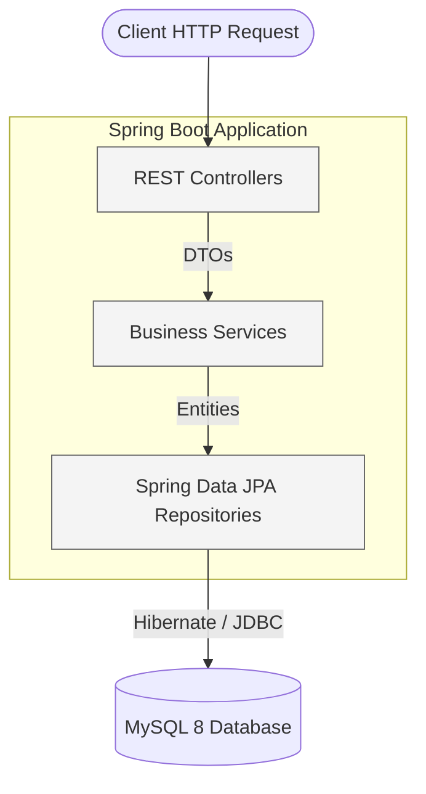
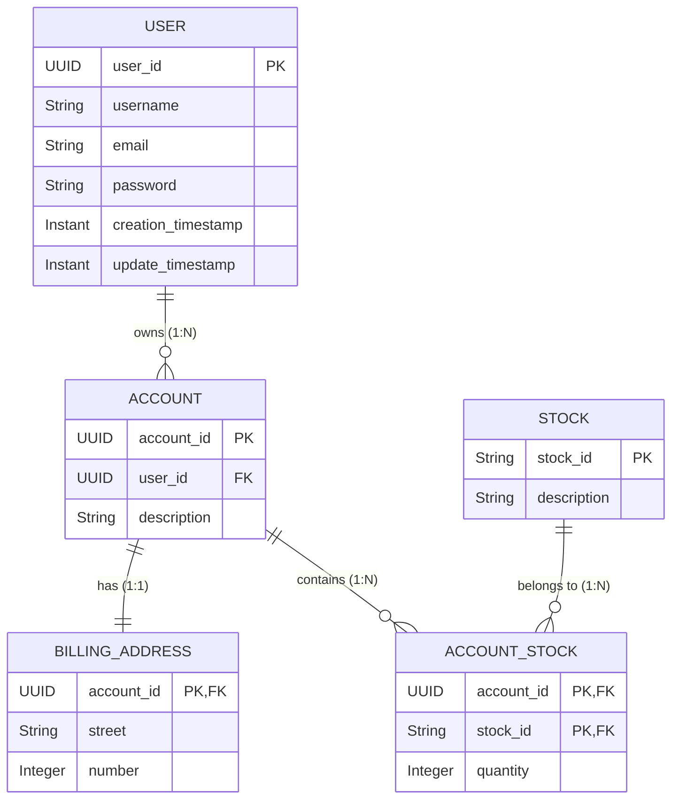
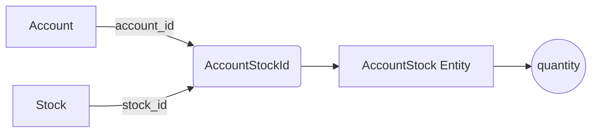
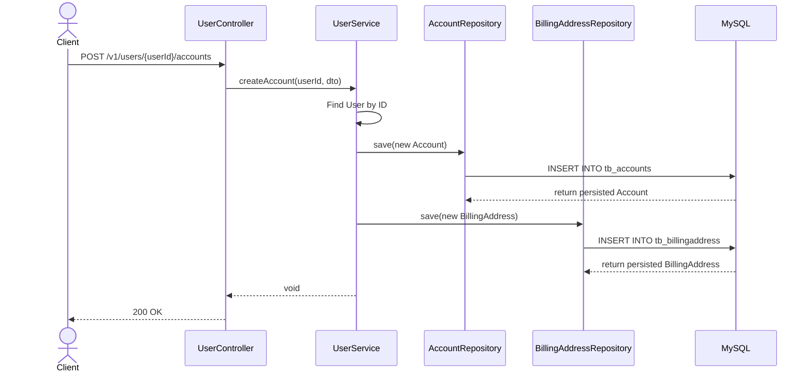

# 📈 Investment Aggregator

> A professional REST API for managing users, investment accounts, billing addresses, and stock portfolios.

<p align="center">
  
  
  
  
  
</p>

## 📋 Table of Contents

- [Overview](#-overview)
- [Architecture](#-architecture)
- [Domain Model](#-domain-model)
- [Key Engineering Concepts](#-key-engineering-concepts)
- [Composite Key Design](#-composite-key-design)
- [API Reference](#-api-reference)
- [Request Flow](#-request-flow)
- [Getting Started](#-getting-started)
- [Configuration](#-configuration)
- [Testing](#-testing)
- [Engineering Improvements](#-engineering-improvements)
- [Roadmap](#-roadmap)

---

## 📖 Overview

The **Investment Aggregator** is a modern backend service designed to centralize and manage users' investment portfolios. It provides a clean and robust RESTful API for handling users, multi-account structures, billing addresses, and complex many-to-many relationships between investment accounts and stocks.

This project was built to demonstrate solid backend engineering practices, focusing on clean architecture, precise entity mapping, and scalable relational database design.

---

## 🏗️ Architecture

The application follows a standard **Layered Architecture**, ensuring a strong separation of concerns. External representations (DTOs) are strictly decoupled from internal domain entities.



### Layers:
1. **Controller Layer**: Handles HTTP requests, parses inputs via DTOs, and returns standardized responses.
2. **Service Layer**: Contains the core business logic, orchestrating multiple repositories and ensuring domain rules.
3. **Repository Layer**: Interfaces extending `JpaRepository` for seamless data access.
4. **Entity / Domain Layer**: JPA-mapped Java classes representing the core business models.

---

## 🗄️ Domain Model

The database relies on a highly normalized relational schema. Highlights include a strictly mapped `1:1` relationship utilizing shared primary keys (`@MapsId`) and an associative entity (`AccountStock`) for the `N:M` relationship between Accounts and Stocks.



---

## 🚀 Key Engineering Concepts

This project implements several advanced software engineering and Spring Data JPA patterns:

- **Layered Architecture**: Clear boundary between API representations, business logic, and persistence.
- **DTO Pattern (Data Transfer Object)**: Complete isolation of external API requests/responses from internal `Entity` representations.
- **UUID Identifiers**: Prevents ID enumeration attacks and ensures global uniqueness for Users and Accounts across distributed systems.
- **Shared Primary Key (`@MapsId`)**: The `BillingAddress` entity derives its Primary Key directly from its parent `Account`, enforcing a strict `1:1` lifecycle.
- **Composite Primary Keys**: See the [Composite Key Design](#-composite-key-design) section.
- **Dependency Injection**: Constructor-based injection throughout the application to ensure immutability and testability.

---

## 🔑 Composite Key Design

The `AccountStock` entity represents the associative relationship between an `Account` and a `Stock` (e.g., *Account A holds 50 shares of PETR4*). 

To model this accurately without introducing an arbitrary surrogate key, a **Composite Primary Key** (`@EmbeddedId`) is used.



The composite identifier guarantees that an account cannot hold duplicate, distinct records for the same stock, enforcing data integrity directly at the database schema level.

---

## 📡 API Reference

Below is the current set of available endpoints.

| Method | Endpoint | Description | Status |
| :--- | :--- | :--- | :--- |
| `POST` | `/v1/users` | Creates a new user | `201 Created` |
| `GET` | `/v1/users/{userId}` | Retrieves a specific user by ID | `200 OK` / `404 Not Found` |
| `GET` | `/v1/users` | Retrieves a list of all users | `200 OK` |
| `PUT` | `/v1/users/{userId}` | Updates a user's details | `204 No Content` |
| `DELETE` | `/v1/users/{userId}` | Deletes a user by ID | `204 No Content` |
| `POST` | `/v1/users/{userId}/accounts` | Creates a new investment account for a user | `200 OK` |
| `GET` | `/v1/users/{userId}/accounts` | Retrieves all accounts for a specific user | `200 OK` |
| `POST` | `/v1/stocks` | Registers a new stock | `201 Created` |
| `POST` | `/v1/accounts/{accountId}/stocks` | Associates a stock with an account (position) | `200 OK` |
| `GET` | `/v1/accounts/{accountId}/stocks` | Retrieves all stock positions for an account | `200 OK` |

### 📄 Example Payloads

**Create User** (`POST /v1/users`)
```json
{
  "username": "caio",
  "email": "caio@email.com",
  "password": "123"
}
```

**Create Account** (`POST /v1/users/{userId}/accounts`)
```json
{
  "description": "XP Investment Account",
  "street": "Rua A",
  "number": 100
}
```

**Create Stock** (`POST /v1/stocks`)
```json
{
  "stockId": "PETR4",
  "description": "Petrobras PN"
}
```

**Associate Stock to Account** (`POST /v1/accounts/{accountId}/stocks`)
```json
{
  "stockId": "PETR4",
  "quantity": 50
}
```

---

## 🔄 Request Flow

To illustrate the system's internal orchestration, here is the sequence of events when a client creates a new Investment Account along with its Billing Address.



---

## 💻 Getting Started

### Prerequisites
- **Java 21**
- **Docker** and **Docker Compose**
- **Maven 3.9+** (or use the provided Maven Wrapper)

### 1. Start the Database
The project relies on a MySQL 8 container. To spin it up locally in the background, run:
```bash
docker compose up -d
```
*Note: The database runs on port `3307` to prevent conflicts with local MySQL installations.*

### 2. Run the Application
You can run the Spring Boot application using the Maven Wrapper:

**Linux / macOS:**
```bash
./mvnw spring-boot:run
```
**Windows:**
```cmd
.\mvnw.cmd spring-boot:run
```

The REST API will be available at `http://localhost:8080`.

---

## ⚙️ Configuration

The database configuration in `application.properties` connects to the Dockerized MySQL instance:

```properties
spring.datasource.url=jdbc:mysql://localhost:3307/agregadordeinvestimentos
spring.datasource.username=root
spring.datasource.password=root

spring.jpa.database-platform=org.hibernate.dialect.MySQL8Dialect
spring.jpa.hibernate.ddl-auto=update
```

> [!WARNING]
> The property `spring.jpa.hibernate.ddl-auto=update` is used here strictly for local development convenience. In a production environment, this must be disabled in favor of a robust database migration tool like **Flyway** or **Liquibase**.
> 
> Credentials stored in this file are for local development purposes only.

---

## 🧪 Testing

The repository relies on **JUnit 5** and **Mockito** for testing. 

Unit tests are focused on isolating the `Service` layer to validate core business logic without spinning up the entire Spring context or requiring a database connection.

To execute the test suite:
**Linux / macOS:**
```bash
./mvnw test
```
**Windows:**
```cmd
.\mvnw.cmd test
```

---

## 🛠️ Engineering Improvements

The following codebase fixes and structural engineering improvements have been successfully applied:

- **Generated UUID for User IDs**: Migrated from sequential integers to `UUID`s for better distributed system compatibility.
- **Entity Collections Initialization**: Instantiated `List` collections at declaration (`= new ArrayList<>()`) within entities to prevent `NullPointerException`s when appending items before persistence.
- **MySQL Dialect Alignment**: Updated the Hibernate dialect configuration specifically for MySQL 8 to leverage modern database features.
- **Controller Method Naming Corrections**: Refactored `StockController` methods to follow standard Java naming conventions.
- **Maven Clean-Up**: Removed unused Maven metadata and optimized the dependency tree.
- **Test Verification Fixes**: Corrected `Mockito.verify()` assertions within `UserServiceTest` to accurately test deletion logic.

---

## 🗺️ Roadmap & Limitations

While the core functionality is established, this project is treated as an iteratively evolving system. The checklist below separates current capabilities from future engineering milestones.

### Implemented Features
- [x] User management (CRUD)
- [x] Investment accounts creation and aggregation
- [x] Billing addresses (`@MapsId` implementation)
- [x] Stock catalog registration
- [x] Account-Stock associations (Portfolio positions)
- [x] MySQL persistence layer
- [x] Docker Compose development environment setup

### Future Improvements
- [ ] **Bean Validation**: Implement `@Valid` constraints on incoming DTOs.
- [ ] **Global Exception Handling**: Introduce `@ControllerAdvice` for consistent API error responses.
- [ ] **Security (Auth)**: Implement Spring Security with JWT and BCrypt password hashing.
- [ ] **Database Migrations**: Adopt Flyway for strict version-controlled schema definitions.
- [ ] **Portfolio Valuation**: Provide real-time APIs to calculate total position values based on current stock prices.
- [ ] **Transaction Boundaries**: Implement `@Transactional` properly to handle partial failures during orchestrations.
- [ ] **OpenAPI / Swagger**: Auto-generate living API documentation.
